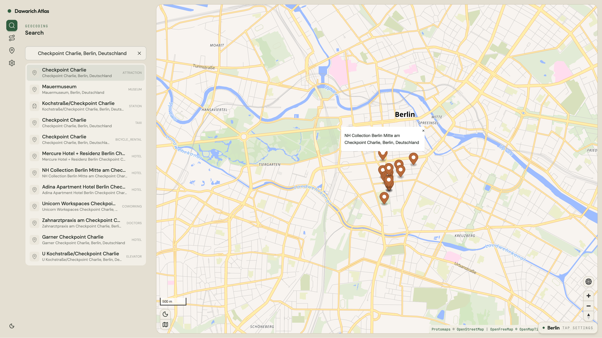
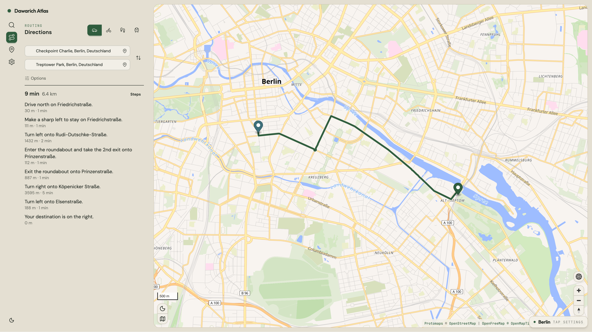
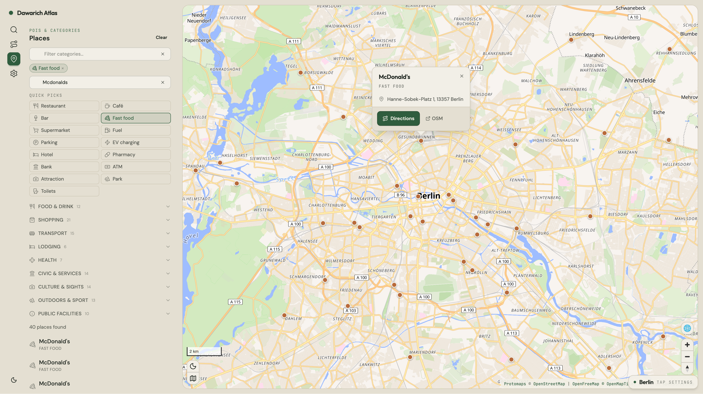
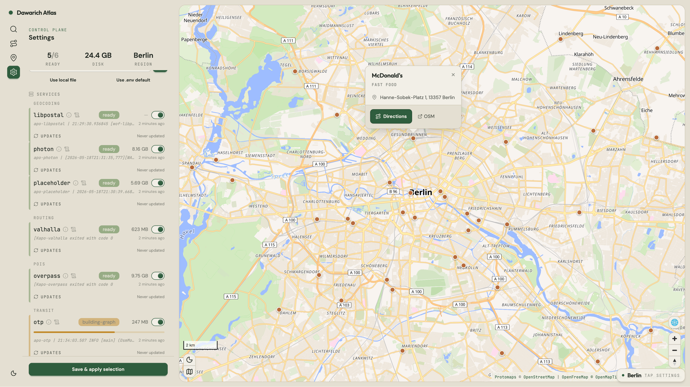

# Dawarich Atlas

A local-first, self-hostable maps stack. Built on OpenStreetMap data and FOSS components, designed to run on hardware you control with zero outbound API calls at runtime.

Atlas is the maps engine that powers Dawarich, packaged so it stands on its own — install it on your own box, plug your own clients into the API.

## Screenshots

| Search | Routing |
|---|---|
|  |  |
| **POIs** | **Settings** |
|  |  |

## Design principles

1. **Local-first.** Every layer runs on your hardware. No outbound API calls at runtime.
2. **Open data only.** OSM, SRTM, GTFS — all freely downloadable.
3. **MapLibre GL** as the renderer. Vector-first.
4. **PMTiles** as the tile format. Static files, no tile server process.
5. **Minimal overlap, minimal resource consumption.** Each service owns a distinct query type.
6. **Single compose file.** One `compose.yml`, bind mounts under `./data/`, region selected via the admin panel.
7. **Caddy as the edge.** Auto-HTTPS-ready, range requests + compression out of the box.
8. **One Rails codebase + one Go sidecar.** Rails owns the public surface (API + admin UI). A small Go service (`atlas-control`) owns the Docker socket so Rails never has to.

## Architecture

```
                    ┌────────────────────────┐
                    │  Browser (MapLibre)    │
                    └───────────┬────────────┘
                                ▼
                        ┌──────────────┐
                        │    Caddy     │  TLS + /tiles/* static + reverse proxy
                        └───┬────────┬─┘
                  /tiles/*  │        │  /*
                            ▼        ▼
                      ┌────────┐  ┌──────────────────┐         ┌──────────────────┐
                      │ PMTiles│  │      Atlas       │ ──HTTP→ │  atlas-control   │
                      │ static │  │  (Rails: API +   │         │   (Go sidecar,   │
                      │        │  │   admin UI)      │         │   docker socket) │
                      └────────┘  └────────┬─────────┘         └──────────────────┘
                                           │  fan-out (internal Docker network)
       ┌────────┬─────────────┬────────────┼────────────┬────────┐
       ▼        ▼             ▼            ▼            ▼        ▼
    photon  placeholder   libpostal    valhalla     overpass    otp
```

Only Caddy is published on host port `8484`. Everything else stays on the internal Docker network.

Full architecture writeup with per-layer responsibilities: **[atlas-website docs/architecture](https://github.com/dawarich-app/atlas-website/blob/main/docs/architecture.md)**.

## Tech stack

| Layer | Pick |
|---|---|
| App framework | Rails 8 (Ruby 3.4.x) |
| Frontend | Hotwire (Turbo + Stimulus) + MapLibre GL JS |
| Styling | Tailwind CSS v4 + DaisyUI v5 |
| Sidecar | Go 1.22 (atlas-control) |
| Default DB | SQLite (Rails 8: Solid Queue/Cache/Cable) |
| Optional DB | PostgreSQL (`DATABASE_URL=postgres://…`) |
| Edge | Caddy (TLS + static tiles + reverse proxy) |
| Map services | Photon, Placeholder, libpostal, Valhalla, Overpass, OpenTripPlanner |

### Architectural decision: Nominatim dropped

The geocoding stack uses **Photon** (Komoot's prebuilt index, ~70 GB planet vs Nominatim's ~1 TB Postgres) for forward + reverse, **Placeholder** for admin-hierarchy enrichment via Who's on First, and **libpostal** for query normalisation. Tradeoff: no fine-grained structured-address API. Photon still returns the OSM tags. Nominatim can be added back later without disturbing the rest.

## Quickstart

```bash
git clone https://github.com/dawarich-app/atlas.git
cd atlas
cp regions/berlin.env .env
docker compose up -d
```

Visit [http://localhost:8484](http://localhost:8484). The map page is live as soon as Caddy and Atlas come up. Open the **Settings** tab in the side panel to toggle data services (Search, Routing, POIs, Transit) and pick the active region. Save & apply — the sidecar handles downloads + ingest, with progress streaming back over Action Cable.

City scale boots in minutes; country takes hours of background ingest; planet takes days.

Full walkthrough: **[atlas-website docs/quickstart](https://github.com/dawarich-app/atlas-website/blob/main/docs/quickstart.md)**.

## Region presets

Each `regions/<name>.env` is a complete env file defining the OSM PBF URL, Photon country code, default map view, and basemap URL. Built-in presets:

```
regions/
├── berlin.env           # city (BBBike Berlin)        — ~30 MB PBF, ~5 GB total
├── germany.env          # country (Geofabrik DE)      — ~4 GB PBF, ~73 GB total
├── europe.env           # continent (Geofabrik EU)    — ~30 GB PBF, ~280 GB total
├── planet.env           # planet                       — ~75 GB PBF, ~1.15 TB total
├── multi-dach.env       # DE + AT + CH (osmium merge)
└── multi-cities.env     # Berlin + Vienna
```

Switch from the admin UI (Settings → Region → Save & apply) or by copying a preset over `.env` and restarting. Multi-region presets list multiple `PBF_URLS=`; the sidecar downloads each, merges them with [osmium-tool](https://osmcode.org/osmium-tool/), and wires the merged PBF into Valhalla, Overpass, and OTP automatically.

Adding new presets — examples for any [BBBike city](https://download.bbbike.org/osm/bbbike/) or [Geofabrik country](https://download.geofabrik.de/) — is documented in **[atlas-website docs/regions](https://github.com/dawarich-app/atlas-website/blob/main/docs/regions.md)**.

## Compose profiles

Each map-service group sits behind a profile so heavy data services are opt-in.

| Profile | Services | What it enables |
|---|---|---|
| _(default)_ | `caddy`, `app`, `atlas-control` | The map page and API. Other endpoints return `upstream: unavailable` until their profile is started. |
| `geocoding` | `photon`, `placeholder`, `libpostal` | `/api/v1/search`, `/api/v1/reverse`, `/api/v1/whats-here` (label) |
| `routing` | `valhalla` | `/api/v1/route` |
| `pois` | `overpass` | `/api/v1/pois`, `/api/v1/whats-here` (POIs) |
| `transit` | `otp` | `/api/v1/transit` (needs GTFS in `data/gtfs/`) |
| `all` | every map service | Everything except `data-setup` |

```bash
# Boot one profile
docker compose --profile geocoding up -d

# Boot everything
COMPOSE_PROFILES=all docker compose up -d
```

You can also toggle profiles from the admin panel — same effect, click instead of typing.

## Ports

Only Caddy is published. Everything else is reachable inside the Docker network only.

| Port | Exposed | Service |
|---|---|---|
| 8484 | yes | Caddy (fronts Atlas + serves PMTiles) |
| 3000 (internal) | no | Atlas (Rails) |
| 8090 (internal) | no | atlas-control |
| 2322 (internal) | no | Photon |
| 3000 (internal) | no | Placeholder |
| 4400 (internal) | no | libpostal |
| 8002 (internal) | no | Valhalla |
| 80 (internal) | no | Overpass |
| 8080 (internal) | no | OpenTripPlanner |

For debugging, add a `compose.override.yml` that publishes the backend ports you need.

## Custom basemap

The basemap is a single PMTiles file streamed over HTTP range requests. By default Atlas points at a remote Protomaps build:

```bash
echo 'TILES_URL=https://build.protomaps.com/20260514.pmtiles' >> .env
```

Daily Protomaps builds live at `https://build.protomaps.com/<YYYYMMDD>.pmtiles` (~105 GB, planet-wide, older builds purged after ~30 days).

For a fully offline deployment, download the file once and let Caddy serve it locally:

```bash
mkdir -p data/tiles
curl -L "https://build.protomaps.com/$(date +%Y%m%d).pmtiles" -o data/tiles/basemap.pmtiles
echo 'TILES_URL=/tiles/basemap.pmtiles' >> .env
docker compose up -d caddy app
```

Five built-in themes via `protomaps-themes-base`: `light` (default), `dark`, `grayscale`, `white`, `black`. Switch via `TILES_THEME` in `.env`.

## Admin panel

The map page lazy-loads an admin panel via the cog icon. Auth is HTTP Basic:

```bash
echo 'ADMIN_USERNAME=admin' >> .env
echo 'ADMIN_PASSWORD=use-a-real-password' >> .env
docker compose up -d
```

The panel lets you toggle services, switch regions, configure the basemap, and watch ingest progress (Turbo Streams over Action Cable). Every action goes through the Go sidecar; Rails never touches the Docker socket.

OpenAPI for the admin endpoints: `http://localhost:8484/api-docs/admin/swagger.yaml`.

## API

All endpoints live under `/api/v1/` and share one envelope:

```json
{ "data": …, "meta": { "timestamp": "…", "upstream": "ok|unavailable|error" } }
```

Errors are uniform:

```json
{ "error": { "code": "VALIDATION_ERROR | UPSTREAM_UNAVAILABLE | UPSTREAM_ERROR", "message": "…" } }
```

| Method | Path | Purpose |
|---|---|---|
| `GET` | `/api/v1/search` | Forward autocomplete with admin enrichment |
| `GET` | `/api/v1/reverse` | Point → label + admin chain |
| `POST` | `/api/v1/reverse/batch` | Bulk reverse, grid-snapped + cached, ≤ 500 coords / call |
| `GET` | `/api/v1/whats-here` | Label + nearby POIs in a radius |
| `GET` | `/api/v1/route` | Routing + elevation summary |
| `GET` | `/api/v1/transit` | Multimodal journey planning |
| `GET` | `/api/v1/pois` | Category-filtered POIs in a bbox |
| `GET` | `/api/v1/geocode` | Combined: forward if `q=`, reverse if `lat=&lon=` |

OpenAPI 3.0 spec at `http://localhost:8484/api-docs` (Swagger UI) and `http://localhost:8484/api-docs/v1/swagger.yaml` (raw).

## CI / images

CI runs on GitHub Actions (`.github/workflows/`) and publishes four artifacts:

| Job | Trigger | Output |
|---|---|---|
| `test-rails` | push / PR touching `app/**` | RSpec suite |
| `test-sidecar` | push / PR touching `atlas-control/**` | `go test -race ./...` |
| `build-app` | push to `main` touching `app/**` | `ghcr.io/dawarich-app/atlas/app:latest` + `:<sha>` (multi-arch amd64+arm64) |
| `build-control` | push to `main` touching `atlas-control/**` | `ghcr.io/dawarich-app/atlas/atlas-control:latest` + `:<sha>` (multi-arch) |

Compose defaults consume those tags directly — `docker compose up -d` against a fresh checkout pulls from GHCR with no auth.

Override either image when iterating locally:

```bash
APP_IMAGE=atlas-app:dev docker compose build app
APP_IMAGE=atlas-app:dev APP_PULL_POLICY=never docker compose up -d
```

## Development

The Rails app lives under `app/` — see [`app/README.md`](app/README.md) for the scaffolding history and per-component layout. The Go sidecar lives under `atlas-control/` — see [`atlas-control/README.md`](atlas-control/README.md).

End-user documentation lives in the separate [atlas-website repo](https://github.com/dawarich-app/atlas-website) (Docusaurus): architecture deep-dive, full quickstart, region scaling tables, compose profile reference, and the Redoc-rendered API spec.

## License

Dawarich Atlas is licensed under the **GNU Affero General Public License v3.0** ([LICENSE](./LICENSE)) — the same license as Dawarich. Anyone running Atlas as a service must publish their modifications under the same license.

Upstream components retain their own licenses: OSM data is ODbL; Protomaps and MapLibre are BSD-3; Valhalla is MIT; Photon, Overpass and OpenTripPlanner are LGPL-3.0 or AGPL-3.0; Rails is MIT.
